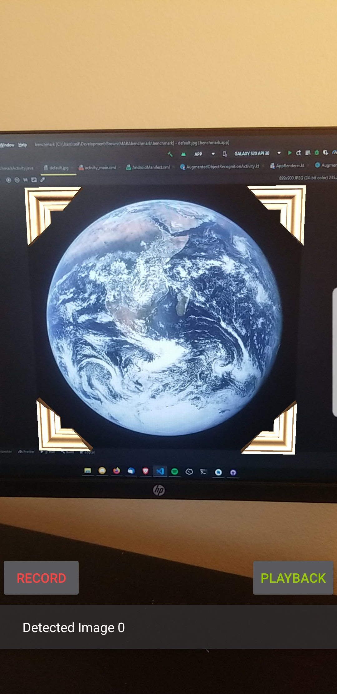

# Augmented Image

An [ARCore](https://developers.google.com/ar) app that can detect and augment 2D images in the user's environment.

  

By default, this app detects an image of Earth then attempts to draw 3D frames around the image.

## Configuring the default image

The default image can be changed by going into /augmented_image/app/src/main/assets and replacing `default.png` with your preferred image.