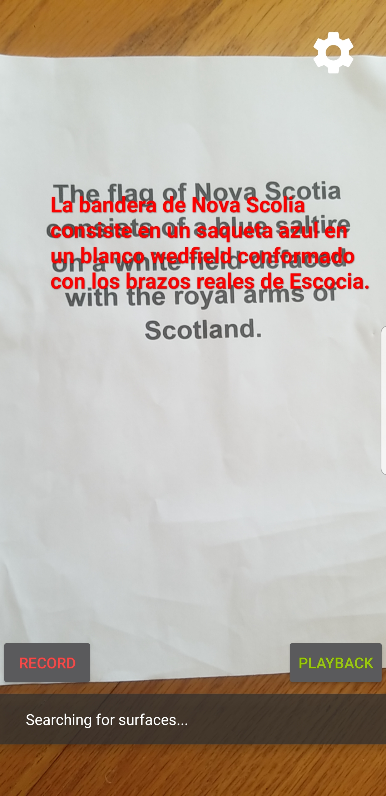

# Camera Translate

An [ARCore](https://developers.google.com/ar) app that when tapped: detects text from the live camera feerd then translates the text to SPanish and dispalys the translated text over the screen.

  

The app uses Tesseract and a trained model to read the text. The app also uses a downloaded model from the Google Translate ML Kit to translate the text into spanish.

When the app is first launched it will copy the Tesseract trained model to the device and will download the Google Translate model from the web.

## Configuring the Tesseract trained model

The default model can be changed by going into /camera_translator/app/src/main/tessdata and replacing `eng.traineddata` with your peferred model.