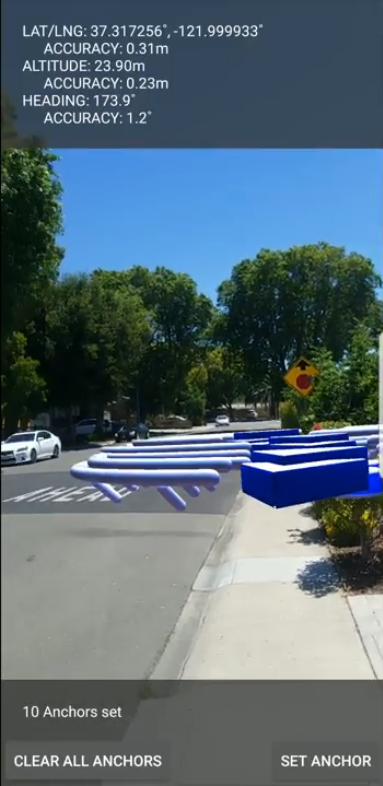

# Geospatial

An [ARCore](https://developers.google.com/ar) sample app using the geospatial API which utilizes Google Earth 3D models and Street View images as well as the device's camera and oboard GPS sensors.

<p align="center">
  
</p>

This sample uses the [Google Cloud Platform](https://cloud.google.com/) to use the Visual Positioning System (VPS).

# Requirements

## Device Support

The app requires the device to be certified to work with ARCore, a list of supported devices can be found [here](https://developers.google.com/ar/devices). The app also requires the device to have a magnetometer that meets the Geospatial API specifications. More info about this can be found [here](https://developers.google.com/ar/develop/java/geospatial/quickstart#device_support).

## Set up Google Cloud Platform

For the app to work, you must obtain an API key from your Google Cloud Project. You can do this by following the steps below:

1. [Create project in Google Cloud Platform.](https://console.cloud.google.com/projectcreate)
2. Click on the navigation menu then click on APIs & Services then click Library.
3. Search for the ARCore API and enable it.
4. Return to the library
5. Search for the Maps SDK for Android and enable it.
6. Navigate to the Credentials page under the APIs & Services sidebar.
7. Click on Create Credentials in the top bar and select API key.
8. Copy the API key that you created as it will be used in the next steps.

Now your Google Cloud Project should be set up. Now you will need to connect the project with the geospatial app.

1. Open the geospatial app in Android Studio.
2. Create a file called `api_keys.xml` under app/src/main/res/values.
3. Paste the following in the xml file: 
    ```<?xml version="1.0" encoding="utf-8"?>
    <resources>
    <string name="AR_API_KEY">YOUR_API_KEY</string>
    </resources>
    ```
4. Replace `YOUR_API_KEY` with the Google Cloud Project API key that you copied earlier.

Your project should now be set up. Additional instructions for how to set up Google Cloud Platform can be found [here](https://developers.google.com/ar/develop/java/geospatial/developer-guide#set_up_authorization).

More informaiton on using the Geospatial API can be found [here](https://developers.google.com/ar/develop/geospatial).

# License

    Copyright 2021 Google LLC

    Licensed under the Apache License, Version 2.0 (the "License");
    you may not use this file except in compliance with the License.
    You may obtain a copy of the License at

        https://www.apache.org/licenses/LICENSE-2.0

    Unless required by applicable law or agreed to in writing, software
    distributed under the License is distributed on an "AS IS" BASIS,
    WITHOUT WARRANTIES OR CONDITIONS OF ANY KIND, either express or implied.
    See the License for the specific language governing permissions and
    limitations under the License.
