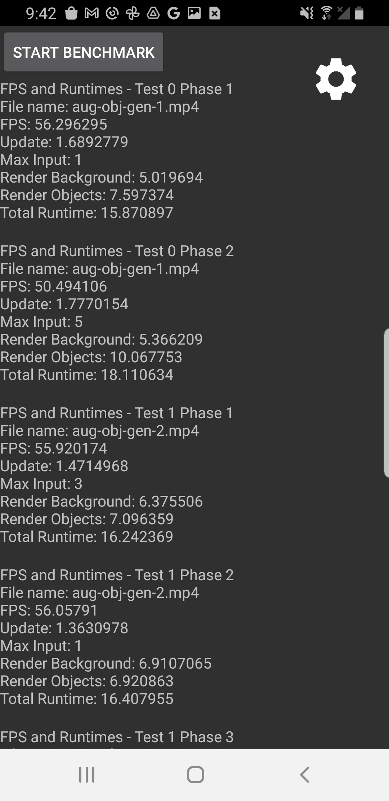
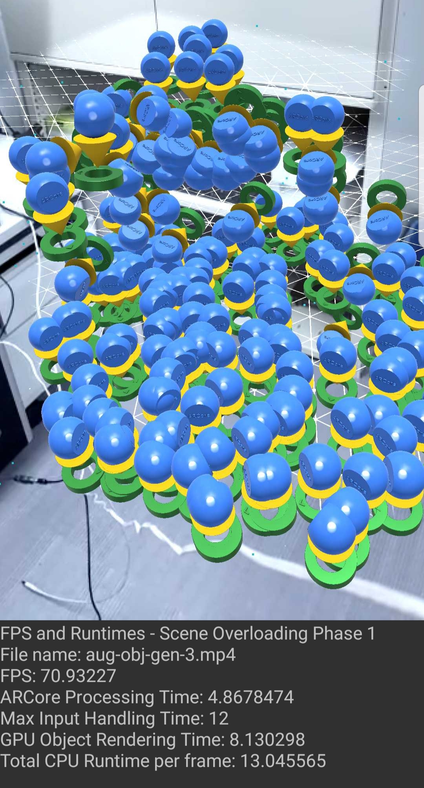
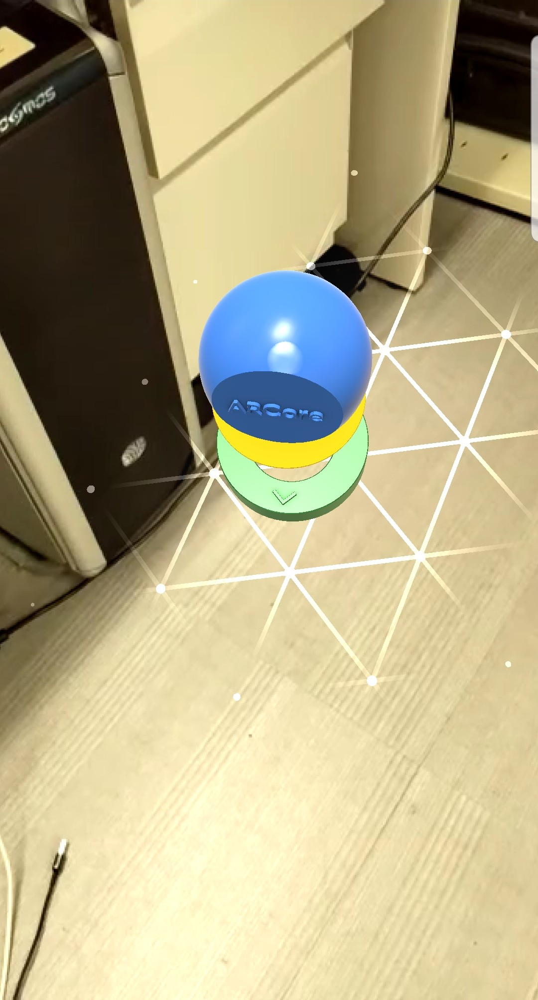
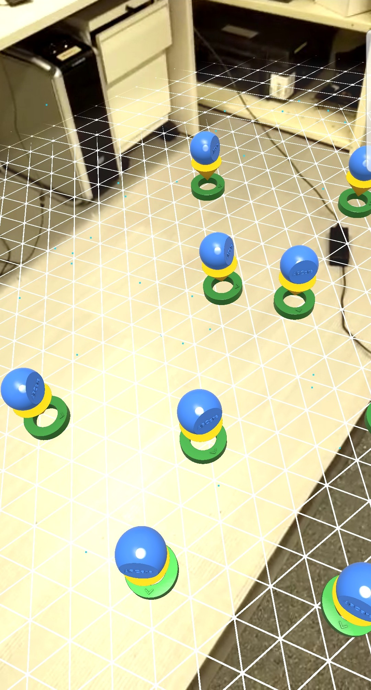
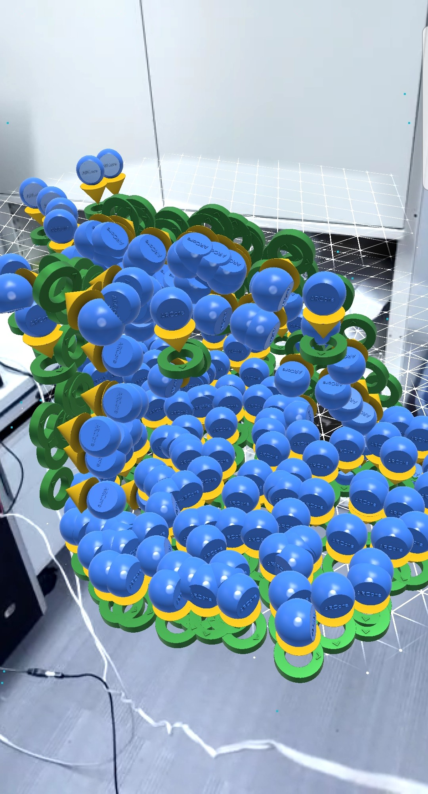
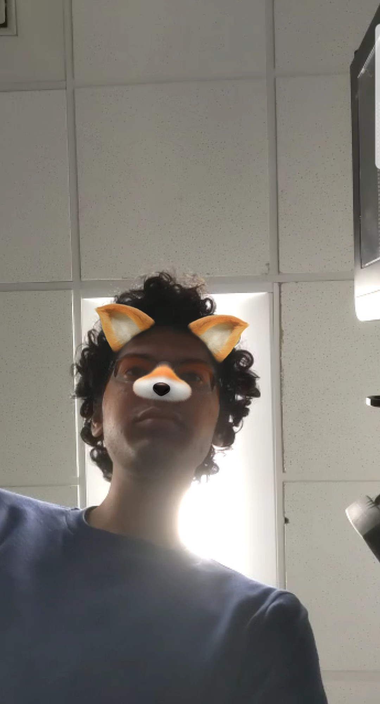
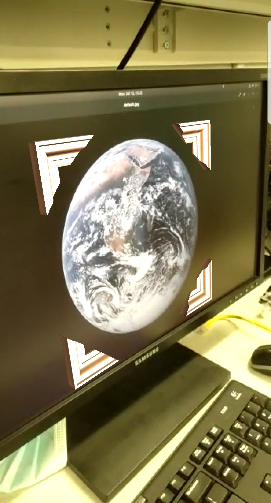
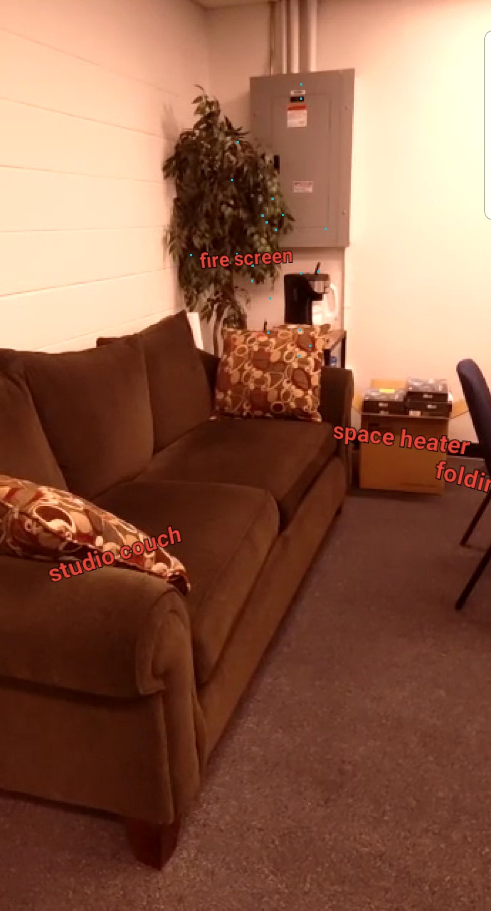

# ARBench

This app includes six sections that represent different Augmented Reality workloads. For each section chosen by the user, the app plays back a recorded user session in an AR application. The performance metrics for each section are then reported.

## Prerequisites
 * [Obtain a credentials.json file (Required for Geospatial section)](https://github.com/scale-lab/ARBench/tree/main/ar-apps/geospatial)
 * [Obtain a object recognition model and a Google Cloud API key (Required for Augmented Object Recognition section)](https://github.com/scale-lab/ARBench/tree/main/ar-apps/augmented_object_recognition)

## Running the Benchmark
1. Open the project in Android Studio. Click Run to launch the app on your device.
2. Select the sections to run and click on Start Benchmark.

## Sections
1. **Object Generation:** Inserts a single object on a surface.
2. **Multiple Objects Interaction:** Maps out a large surface and inserts many objects. Objects are viewed from different angles and distances.
3. **Scene Overloading:** Inserts a large amount of objects in a densely packed fashion so that many objects are on screen at once.
4. **Augmented Faces:** Detects a face and applies a face filter.
5. **Augmented Image:** Detects a 2D target image and augments it witha virtual photo frame.
6. **Object Recognition:** Scans the surrounding scene to identify visible objects and applies a label to them.

## Performance Metrics
* FPS (Offscreen)
* ARCore Processing Time
* Max Input Handling Time
* GPU Object Rendering Time
* Total CPU Runtime

All runtimes are measured per frame.

## Benchmark Data

The recordings for each section can be found in the assets folder under **app/src/main/assets/recordings**. These are videos in MP4 format with separate data tracks for user input. The recordings and corresponding sections are listed below:

1. aug-obj-gen-1.mp4: Object Generation
2. aug-obj-gen-2.mp4: Multiple Objects Interaction
3. aug-obj-gen-3.mp4: Scene Overloading
4. aug-faces-1.mp4: Augmented Faces
5. aug-img-1.mp4: Augmented Image
6. aug-obj-rcg-1.mp4: Object Recognition

**app/src/main/assets/mnasnet_0.50_224_1_metadata_1.tflite** contains the classification model used in the Object Recognition section. Images and 3D models used by the benchmark can also be found in the assets folder.

## Screenshots

<p align="center">
  
  
  
  
  
  
  
  
</p>

## Adding new benchmarks
1. Open the BenchmarkActivity.java file located in `benchmark/app/src/main/java/benchmark/benchmark/BenchmarkActivity.java`
2. Locate the ACTIVITY_RECORDINGS array at the top of the activity.
3. Create a new ActivityRecording object inside the array.
4. Refer to the ActivityRecording.java class and the documentation below to configure your ActivityRecording.
```
Class<?> activity: The activity class the benchmark will run.

String recordingFileName
  The name of the video file that will be played back.

String sectionName
  The name in which the section will appear in the benchmark app.

boolean enabled
  Tells the app whether it should play this section or skip it.

boolean useCloud
  Should be set to true if the activity uses the cloud for some of its tasks.

boolean requiresCredentialsFile
  If the section requires a credentials file to work. The app will disable the section if this value is set to true and the credentials file is missing.

boolean requiresGCPKeys
  If the section requires Google Cloud Platform keys to work. will disable the section if this value is set to true and the keys are missing.
```