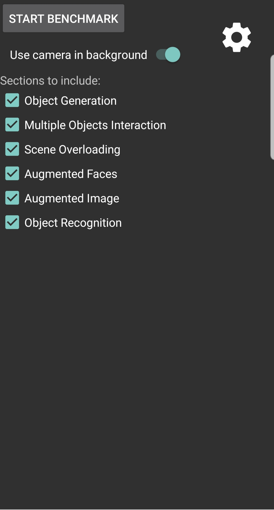

# Benchmark App

This app includes six sections that represent different Augmented Reality workloads. For each section chosen by the user, the app plays back a recorded user session in an AR application. The performance metrics for each section are then reported.

## Running the Benchmark
1. Open the project in Android Studio. Click Run to launch the app on your device.
2. Select the sections to run and click on Start Benchmark.

## Sections
1. **Object Generation:** Inserts a single object on a surface.
2. **Multiple Objects Interaction:** Maps out a large surface and inserts many objects. Objects are viewed from different angles and distances.
3. **Scene Overloading:** Inserts a large amount of objects in a densely packed fashion so that many objects are on screen at once.
4. **Augmented Faces:** Detects a face and applies a face filter.
5. **Augmented Image:** Detects a 2D target image and augments it witha virtual photo frame.
6. **Object Recognition:** Scans the surrounding scene to identify visible objects and applies a label to them.

## Performance Metrics
* FPS (Offscreen)
* ARCore Processing Time
* Max Input Handling Time
* GPU Object Rendering Time
* Total CPU Runtime

All runtimes are measured per frame.

## Benchmark Data

The recordings for each section can be found in the assets folder under **app/src/main/assets/recordings**. These are videos in MP4 format with separate data tracks for user input. The recordings and corresponding sections are listed below:

1. aug-obj-gen-1.mp4: Object Generation
2. aug-obj-gen-2.mp4: Multiple Objects Interaction
3. aug-obj-gen-3.mp4: Scene Overloading
4. aug-faces-1.mp4: Augmented Faces
5. aug-img-1.mp4: Augmented Image
6. aug-obj-rcg-1.mp4: Object Recognition

**app/src/main/assets/mnasnet_0.50_224_1_metadata_1.tflite** contains the classification model used in the Object Recognition section. Images and 3D models used by the benchmark can also be found in the assets folder.

## Screenshots

  
  
  
  
  
  
  
  

